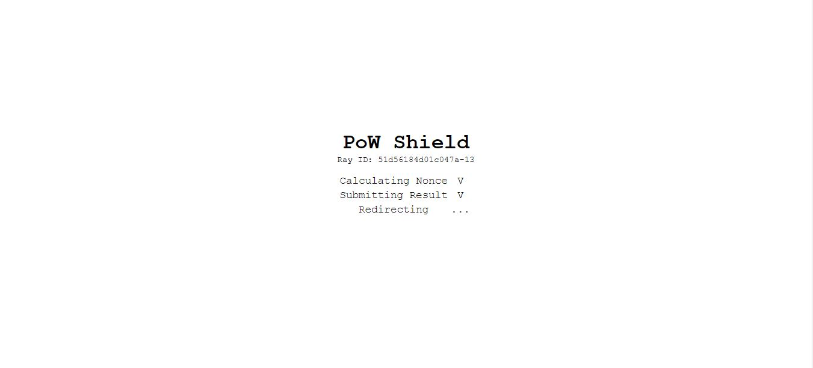

# PoW Shield
Project dedicated to provide DDoS protection with proof-of-work


## Description
PoW Shield provides DDoS protection on OSI application layer by acting as a proxy between the backend service and the end user. This project aims to provide an alternative to general captcha methods such as Google's ReCaptcha that has always been a pain to solve. Accessing a web service protected by PoW Shield has never been easier, simply to to the url, and your browser will do the rest of the work for you.

## Usage
github repo
```
# clone repo first
npm install
cp config.example.js config.js
# edit config.js
npm run build
npm start
```
dockerhub (work in progress)

## Configuration
```
module.exports = {
  session_key: 'abcdefghijklmnop', // secret key for session signatures, use a unique one for security
  waf: true, // enable waf function, true=on / false=off
  pow: true, // enable pow function, true=on / false=off
  nonce_validity: 60000, // restricts time limit that a nonce can be submitted to the server after produced
  initial_difficulty: 13, // number of heading 0 bits in produced hash (0:extremely easy ~ 256:impossible, 13:about 5 seconds )
  backend_url: 'http://example.com', // server to proxy traffic to after authorization passed
}
```

## TODOs
- [x] Web Service Structure
- [x] Proxy Functionality
- [x] PoW Implementation
- [ ] WAF Implementation
- [ ] IP Blacklisting
- [ ] Unit Tests
- [ ] Docker Image
- [ ] Multi-Instance Syncing

## License
BSD 3-Clause License

Copyright (c) 2021, RuiSiang
All rights reserved.

Redistribution and use in source and binary forms, with or without
modification, are permitted provided that the following conditions are met:

1. Redistributions of source code must retain the above copyright notice, this
   list of conditions and the following disclaimer.

2. Redistributions in binary form must reproduce the above copyright notice,
   this list of conditions and the following disclaimer in the documentation
   and/or other materials provided with the distribution.

3. Neither the name of the copyright holder nor the names of its
   contributors may be used to endorse or promote products derived from
   this software without specific prior written permission.

THIS SOFTWARE IS PROVIDED BY THE COPYRIGHT HOLDERS AND CONTRIBUTORS "AS IS"
AND ANY EXPRESS OR IMPLIED WARRANTIES, INCLUDING, BUT NOT LIMITED TO, THE
IMPLIED WARRANTIES OF MERCHANTABILITY AND FITNESS FOR A PARTICULAR PURPOSE ARE
DISCLAIMED. IN NO EVENT SHALL THE COPYRIGHT HOLDER OR CONTRIBUTORS BE LIABLE
FOR ANY DIRECT, INDIRECT, INCIDENTAL, SPECIAL, EXEMPLARY, OR CONSEQUENTIAL
DAMAGES (INCLUDING, BUT NOT LIMITED TO, PROCUREMENT OF SUBSTITUTE GOODS OR
SERVICES; LOSS OF USE, DATA, OR PROFITS; OR BUSINESS INTERRUPTION) HOWEVER
CAUSED AND ON ANY THEORY OF LIABILITY, WHETHER IN CONTRACT, STRICT LIABILITY,
OR TORT (INCLUDING NEGLIGENCE OR OTHERWISE) ARISING IN ANY WAY OUT OF THE USE
OF THIS SOFTWARE, EVEN IF ADVISED OF THE POSSIBILITY OF SUCH DAMAGE.
