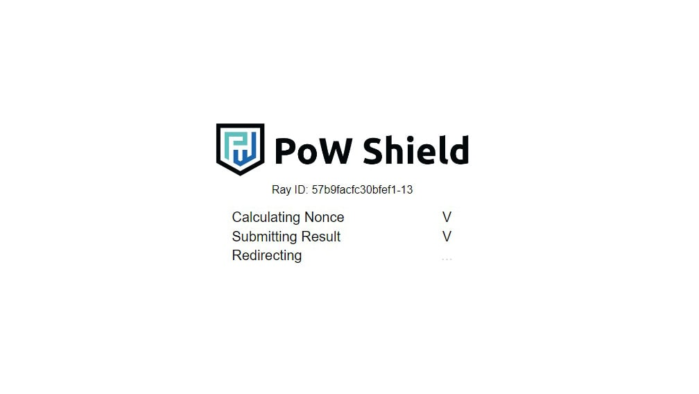

# PoW Shield
Project dedicated to provide DDoS protection with proof-of-work


## Description
PoW Shield provides DDoS protection on OSI application layer by acting as a proxy between the backend service and the end user. This project aims to provide an alternative to general captcha methods such as Google's ReCaptcha that has always been a pain to solve. Accessing a web service protected by PoW Shield has never been easier, simply to to the url, and your browser will do the rest of the work for you.

## Usage
github repo
```
# clone repo first
npm install
cp config.example.js config.js
# edit config.js
npm run build
npm start
```
dockerhub (work in progress)

## Configuration
```
module.exports = {
  session_key: 'abcdefghijklmnop', // secret key for session signatures, use a unique one for security
  waf: true, // enable waf function, true=on / false=off
  pow: true, // enable pow function, true=on / false=off
  nonce_validity: 60000, // restricts time limit that a nonce can be submitted to the server after produced
  initial_difficulty: 13, // number of heading 0 bits in produced hash (0:extremely easy ~ 256:impossible, 13:about 5 seconds )
  backend_url: 'http://example.com', // server to proxy traffic to after authorization passed
}
```

## TODOs
- [x] Web Service Structure
- [x] Proxy Functionality
- [x] PoW Implementation
- [ ] WAF Implementation
- [ ] IP Blacklisting
- [ ] Unit Tests
- [ ] Docker Image
- [ ] Multi-Instance Syncing
